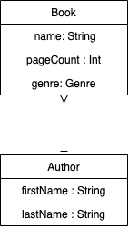

# GraphQL Demo

This repo contains a Graphql API example using Spring Boot.

## Schema
```
type Query {
  bookById(id: ID): Book
}

type Mutation {
  createBook(name: String!, pageCount: Int!, genre: Genre!): Book
}

enum Genre {
  HISTORY
  DRAMA
  THRILLER
}

type Book {
  id: ID
  name: String
  pageCount: Int
  genre: Genre
  author: Author
}

type Author {
  id: ID
  firstName: String
  lastName: String
}
```
## Models



## Recommended lectures

* [GraphQL Java Kickstart](https://www.graphql-java-kickstart.com)
* [GraphQL Java Tutorial](https://www.pluralsight.com/guides/building-a-graphql-server-with-spring-boot)

